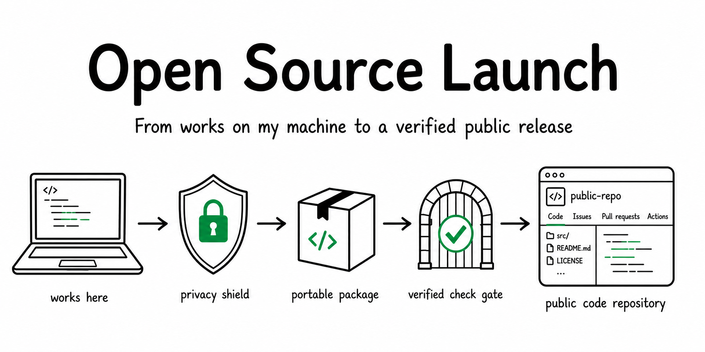
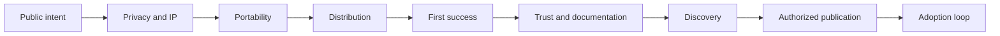

<p align="right">
  <strong>English</strong> · <a href="README.zh-CN.md">简体中文</a>
</p>

# Open Source Launch

**Turn a local or private project into a portable, privacy-reviewed, discoverable, and verified public GitHub release.**

[](https://github.com/JNHFlow21/open-source-launch/actions/workflows/test.yml)
[](https://github.com/JNHFlow21/open-source-launch/releases)
[](LICENSE)



> **Beta:** the workflow and bundled scripts are tested, but launch decisions still require repository-specific privacy, licensing, platform, and distribution review.

## Why this exists

Making a repository public is not the same as shipping an open-source product.
A polished README cannot fix a package that only runs from the maintainer's
checkout, remove a credential from Git history, grant missing reuse rights, or
prove that a stranger can reach first value.

Open Source Launch gives Codex a repeatable release contract:

```text
private/local project
  -> privacy and IP gate
  -> portable artifact
  -> clean-room first success
  -> conversion README and discovery metadata
  -> authorized public release
  -> measured adoption loop
```

It includes deterministic helpers for public-surface auditing and an optional
white-background Repository Pulse chart. It does **not** silently publish,
merge, change visibility, or place credentials in documentation.

## Quick start

### 1. Install with Codex's built-in Skill Installer

Ask Codex:

```text
Use $skill-installer to install open-source-launch from
https://github.com/JNHFlow21/open-source-launch/tree/main/skills/open-source-launch
```

Or run the same installer helper directly:

```bash
python3 "${CODEX_HOME:-$HOME/.codex}/skills/.system/skill-installer/scripts/install-skill-from-github.py" \
  --repo JNHFlow21/open-source-launch \
  --path skills/open-source-launch
```

Start a new Codex turn after installation so the Skill can be discovered.

### 2. Run a read-only launch audit

```text
Audit this repository with open-source-launch. Do not modify files or remote state.
```

Expected result: a gate report separating blockers, warnings, verified claims,
and missing evidence. Static scanning is only the first gate; it never labels a
project launch-ready by itself.

### 3. Prepare or launch

```text
Prepare this project for an open-source GitHub launch, but do not publish it.
```

When every gate is clean and you intend to authorize remote publication:

```text
Launch this project as open source. Complete the verified PR, repository metadata,
release, and live readback path.
```

## Four operating modes

| Mode | Purpose | Remote writes |
| --- | --- | --- |
| `audit` | Read-only readiness and gap report | Never |
| `prepare` | Fix portability, public surface, docs, and release assets in an isolated branch/worktree | No visibility or release changes |
| `launch` | Complete the verified publication path | Only with explicit authorization |
| `refresh` | Update an existing public repository's docs, discovery surfaces, screenshots, metrics, or release material | Authorized scope only |

## What it standardizes

### Safety before presentation

- current-tree and Git-history credential review;
- personal data, media, logs, databases, private hosts, and machine-path review;
- third-party code, asset provenance, and license gates;
- fail-closed publication decisions with redacted findings.

### Stranger-first portability

- declared runtimes, dependencies, configuration, permissions, and network needs;
- no hidden reliance on the maintainer's `$HOME`, shell aliases, keychain, or checkout;
- clean clone/archive, isolated HOME, canonical install, first result, and recovery/update evidence.

### Public repository productization

- LICENSE, SECURITY, CONTRIBUTING, CI, releases, and support routes that match the real maintenance model;
- evidence-backed English README plus synchronized translations when needed;
- focused GitHub description, topics, social preview, natural search language, and stable citation routes;
- optional privacy-safe repository activity chart near the end of the README.

### Adoption after publication

- channel-specific launch drafts without automatic posting;
- measurement from qualified discovery through first success and retention;
- explicit separation of observed, inferred, and missing evidence.

## Gate model



Every consequential public claim is classified as:

- **verified** — observed in the intended public artifact or live repository;
- **planned** — clearly labeled roadmap work;
- **missing evidence** — not safe to advertise yet.

## Deterministic audit

The bundled auditor uses the Python standard library and reports finding
locations without echoing matched secret values:

```bash
python3 skills/open-source-launch/scripts/audit_open_source.py . --json
```

For a local release gate with Gitleaks installed:

```bash
python3 skills/open-source-launch/scripts/audit_open_source.py . \
  --run-gitleaks --strict
```

It checks repository-package basics, credential-shaped content, tracked
environment files, private/machine-specific references, risky artifacts,
external symlinks, runtime declarations, and Git state. Heuristics can require
human review; a clean report does not replace history, media/IP, clean-install,
CI, or live-settings verification.

## Repository Pulse

Install the optional white sketch-style chart after authenticating `gh` as the
repository owner:

```bash
python3 skills/open-source-launch/scripts/install_repository_pulse.py \
  /path/to/repository \
  --repository OWNER/REPOSITORY \
  --collect-traffic
```

The installer writes three component files and prints the README snippet. It
does not edit README, commit, push, create a branch, or change visibility.
GitHub Traffic data is stored only as a dated aggregate rolling 14-day snapshot;
the public README URL never contains a long-lived token.

## Requirements and boundaries

- Designed and verified for Codex Skills; other `SKILL.md`-compatible agents may work but are not part of the verified support claim.
- Python 3.10+ is required only for the deterministic helper scripts.
- `git` is required for tracked-file and working-tree evidence.
- `gh`, authenticated owner access, and Gitleaks are optional and used only for the corresponding GitHub/secret-history gates.
- No telemetry is included.
- Remote writes always follow the requested mode and authorization boundary.
- The workflow targets GitHub repositories; other forges require adaptation.

## Repository layout

```text
skills/open-source-launch/
├── SKILL.md
├── agents/openai.yaml
├── scripts/
│   ├── audit_open_source.py
│   └── install_repository_pulse.py
├── references/
└── assets/repository-pulse/
```

The Skill stays self-contained under `skills/open-source-launch/`; repository
documentation and community files remain outside the Skill package.

## Development

```bash
python3 -m unittest discover -s skills/open-source-launch/tests -v
python3 -m compileall -q skills/open-source-launch
```

Before a release, also run the auditor with `--run-gitleaks --strict`, validate
the exact installation route from a temporary Codex home, and read back the
live repository/release state.

## Reference contracts

- [Readiness and publication gates](skills/open-source-launch/references/readiness-contract.md)
- [Stranger-first portability](skills/open-source-launch/references/portability-contract.md)
- [Conversion README](skills/open-source-launch/references/readme-contract.md)
- [GitHub discovery, SEO, and GEO](skills/open-source-launch/references/discovery-contract.md)
- [Repository Pulse](skills/open-source-launch/references/repository-pulse.md)
- [Open-source adoption](skills/open-source-launch/references/adoption-contract.md)

## Support and bug reports

For usage questions or reproducible non-sensitive problems, use
[GitHub Issues](https://github.com/JNHFlow21/open-source-launch/issues/new/choose)
with a synthetic example. Use private vulnerability reporting for anything
that could expose a credential, private repository, personal data, or exploit.

## Repository activity

[](https://github.com/JNHFlow21/open-source-launch)

GitHub Traffic values are a dated rolling 14-day owner snapshot; public stars,
forks, and commits refresh automatically.

## Contributing, security, and license

- Read [CONTRIBUTING.md](CONTRIBUTING.md) before opening a pull request.
- Report vulnerabilities through [GitHub private vulnerability reporting](https://github.com/JNHFlow21/open-source-launch/security/advisories/new), not a public issue.
- Open-source under the [MIT License](LICENSE).
